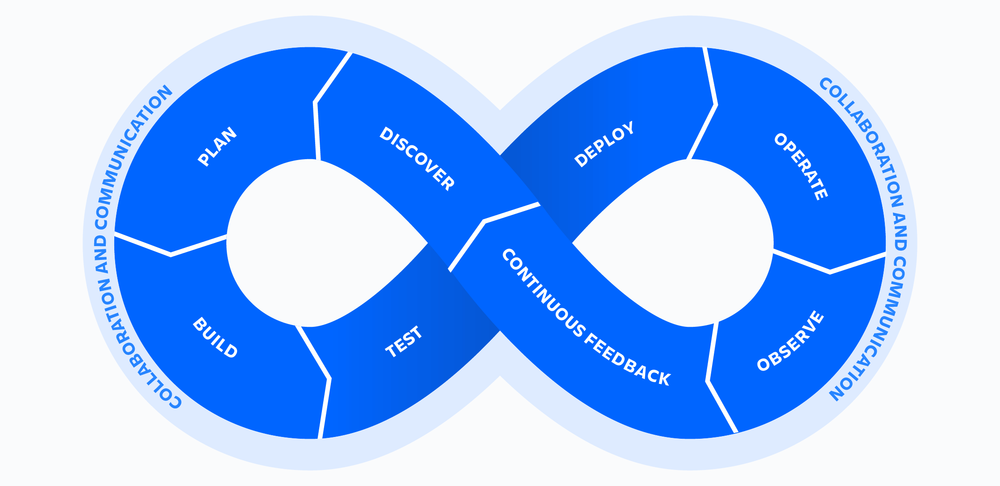

# Secret Management in DevOps

### Introduction

DevOps promotes speed and automation. But speed may become a security risk if secrets aren't managed properly. In this tutorial, you'll learn how to protect secrets using [Infisical](https://infisical.com/) and prevent one of the most common vulnerabilities: hardcoded credentials in source code.

But first of all, what are secrets? Secrets include API keys, passwords, database credentials, JWT tokens, private keys, OAuth tokens, encryption keys - anything piece of data that should never be publicly shared.

Secrets can appear everywhere in a DevOps cycle:

For example:
- **Build**: API keys and database credentials in your code
- **Test**: Secrets needed for automated testing
- **Deploy**: CI/CD pipelines need credentials to push to production
- **Operate**: Services communicate using tokens and keys

**The problem:** One exposed secret can risk your entire workflow.

### Real Examples

- **[Hugging Face (2024)](https://huggingface.co/blog/space-secrets-disclosure)**: Attackers accessed their Spaces platform and stole API tokens, forcing a mass revocation of user credentials.
- **[Snowflake (2024)](https://cloudsecurityalliance.org/blog/2025/05/07/unpacking-the-2024-snowflake-data-breach)**: Stolen credentials compromised 160+ organizations including Ticketmaster and Santander.
- **[AWS Credential Leak (2024)](https://www.techradar.com/pro/security/aws-customers-hit-by-major-cyberattack-which-then-stored-stolen-credentials-in-plain-sight)**: Misconfigured cloud instances exposed credentials and source code that attackers stored in plain sight.

### Learning Outcomes

By the end of this tutorial, you will be able to:

1. **Understand** security risks of hardcoded secrets in source code
2. **Detect** exposed secrets using automated scanning tools
3. **Prevent** secret leaks with pre-commit hooks and CI/CD integration
4. **Store** secrets securely using centralized secret management
5. **Manage** stage-specific secrets (development, staging, production)

### Prerequisites

You'll need free accounts for [GitHub](https://github.com) and [Infisical](https://infisical.com). We'll guide you through the setup.

Estimated time for the entire tutorial: 45-60 minutes.

Let's start!

_This tutorial is authored by [Fauzan Helmi Sudaryanto](https://github.com/ujanjan) & [Amin Nouiser](https://github.com/noizy-sthlm) for [DD2482 DevOps course](https://github.com/KTH/devops-course/pull/2827)._