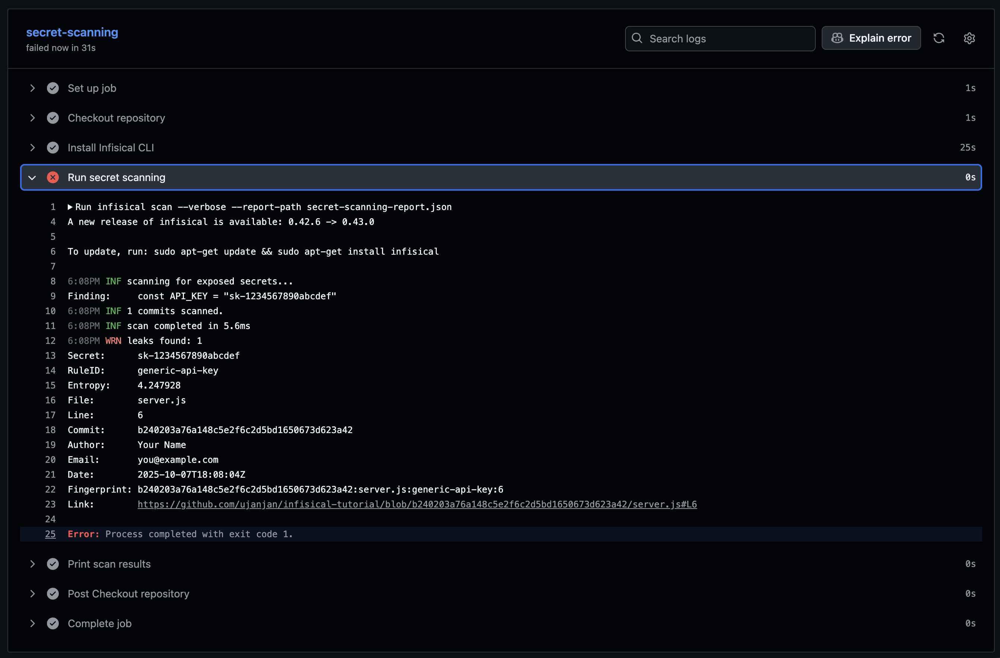

# Secrets Scanning with Infisical

Now that we have a repository with hardcoded secrets, let's learn how to detect and prevent these security vulnerabilities using Infisical's powerful scanning capabilities. This section will walk you through setting up automated secret detection in your development workflow.

### Install Infisical CLI

For this tutorial, we'll install the Infisical CLI in our environment. The CLI allows us to run local scans and integrate with our development workflow. Follow this [installation instructions](https://infisical.com/docs/cli/overview) for other OS.


```bash
curl -1sLf \
'https://artifacts-cli.infisical.com/setup.deb.sh' \
| sudo -E bash
# Update package list and install Infisical CLI
apt-get update && apt-get install -y infisical
```{{exec}}

Next, we can check if Infisical is properly installed.

```bash
# Verify installation
infisical --version
```{{exec}}

## Running Your First Scan

Now let's scan our repository to detect the hardcoded secrets we created in the previous section.

### Basic Scan

Start with a basic scan to see what Infisical can detect:

```
# Run initial scan on current directory
infisical scan
```{{exec}}

This scans your git history for the current repository and alerts you for any commited secrets.

To scan your directory instead of commit history, use:

```bash
infisical scan --no-git
```{{exec}}

### Detailed Scan Results

To get more detailed information about the findings, let's run the scan with verbose output:

```
# Run scan with detailed findings
infisical scan --verbose
```{{exec}}

The `--verbose` flag provides additional context about each finding, including:
- The file containing the secret
- The line number
- The type of secret detected

Note that Infiscal did not detect all of our secrets! It did however catch one, which is better than none 🤠 By default, Infisical catches the most common secrets, but, when using custom formats, it may be necessary to customize your scan (see [Configuration file](https://infisical.com/docs/cli/scanning-overview#configuration-file)).

## Setting Up Pre-commit Hooks

To prevent secrets from being committed in the first place, let's set up a [pre-commit hook](https://medium.com/@jay.gokani/pre-commit-hooks-39bb1668dc95) that automatically scans code before each commit.

### Install Infisical Pre-commit Hook

```
# Install the pre-commit scanning hook
infisical scan install --pre-commit-hook
```{{exec}}

This command will:
- Create a git pre-commit hook
- Configure it to run Infisical scans before each commit
- Prevent commits that contain detected secrets

### Test the Pre-commit Hook

Let's test our pre-commit hook by trying to create a new file with secrets `test-secret.js`:

```
# Create a test file with a secret
echo 'const NEW_API_KEY = "sk-abcdefgh12345324";' > test-secret.js
```{{exec}}

And now let's commit it.

```
# Try to commit the file (this should be blocked)
git add test-secret.js
git commit -m "test commit with secret"
```{{exec}}

The pre-commit hook should detect the secret and prevent the commit, showing you the scan results and blocking the commit until the secret is removed.

Let's remove the `test-secret.js` file so we can focus on the main `server.js` file we created earlier:

```
# Remove the test file
git restore --staged .
rm test-secret.js
```{{exec}}

### Managing the Pre-commit Hook

If you ever want to temporarily disable the pre-commit hook:

```
# Disable the pre-commit hook
git config --bool hooks.infisical-scan false
```{{exec}}

To re-enable it:

```
# Re-enable the pre-commit hook
git config --bool hooks.infisical-scan true
```{{exec}}

## GitHub Actions Integration

For continuous security monitoring, let's set up GitHub Actions to automatically scan our repository on every push.

### Create GitHub Actions Workflow

Create a new workflow for secret scanning:

```
# Create the workflow directory
mkdir -p .github/workflows
```{{exec}}

```
# Create the secret scanning workflow
cat > .github/workflows/secret-scanning.yml << 'EOF'
name: Secret Scanning

on:
  push:
    branches:
      - main
  pull_request:
    branches:
      - main

jobs:
  secret-scanning:
    runs-on: ubuntu-22.04
    steps:
      - name: Checkout repository
        uses: actions/checkout@v5

      - name: Install Infisical CLI
        run: |
          curl -1sLf \
          'https://artifacts-cli.infisical.com/setup.deb.sh' \
          | sudo -E bash
          sudo apt-get update && sudo apt-get install -y infisical

      - name: Run secret scanning
        run: |
          infisical scan --verbose --report-path secret-scanning-report.json

      - name: Print scan results
        if: always()
        run: |
          cat secret-scanning-report.json
EOF
```{{exec}}

This workflow will:
- Trigger on pushes and pull requests to the main branch
- Run a scan on the branch
- Display the results in the Actions logs

### Commit and Push the Workflow

```bash
# Add and commit the workflow file
git add .github/workflows/secret-scanning.yml
git commit -m "Add GitHub Actions secret scanning workflow"
git push origin main
```{{exec}}

The workflow should fail and detect the previously commited secret.

1. **View the Workflow Run**:
   - Go to your GitHub repository
   - Click on the "Actions" tab
   - You should see the "Secret Scanning" workflow running
   - Click on it to view the detailed results

2. **Review the Results**:
   - The workflow should detect the hardcoded secrets in your `server.js` file
   - Check the logs to see the detailed scan report


<br />

## Complementary scans

The :
- Pre-commit hook should prevent commits from ever beeing commited in the first place
- A GitHub Workflow detects any secrets that where not caught by any pre-commit hooks (A developer may bypass it for various reasons)

In a real repository, contributions may be made as a push or as pull requests which is why a scan workflow may need to be triggered on both (Pull requests will not be covered in this tutorial, but you can try to open one with commited secrets and see that it is detected)

## What's Next?

We've successfully set up a working secret scanning solution that includes:

- **Local scanning** with the Infisical CLI
- **Pre-commit hooks** to prevent secrets from being committed
- **GitHub Actions** for continuous monitoring

This will help both solo or team development to scan vulnerabilities early on.

In the next section, we'll learn how to properly handle secrets using Infisical's secret management features, replacing our hardcoded secrets with more secure alternatives.