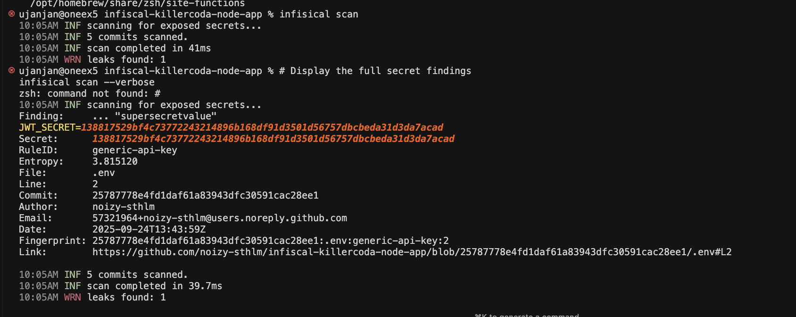
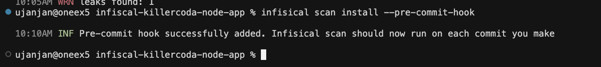

# Secrets Scanning with Infisical

Now that we have a repository with hardcoded secrets, let's learn how to detect and prevent these security vulnerabilities using Infisical's powerful scanning capabilities. This section will walk you through setting up automated secret detection in your development workflow.

## Setting Up Infisical

### Create Infisical Account

First, we need to create a free account with Infisical to access their scanning services:

1. **Sign up for Infisical**
   - Visit [infisical.com](https://infisical.com) 
   - Create a free account to get started
   - This will give you access to Infisical's cloud-based scanning services

### Install Infisical CLI

For this tutorial, we'll install the Infisical CLI on our Ubuntu environment. The CLI allows us to run scans locally and integrate with our development workflow.

```
# Add Infisical repository to your system
curl -1sLf \
'https://artifacts-cli.infisical.com/setup.deb.sh' \ 
| sudo -E bash
```{{exec}}

```
# Update package list and install Infisical CLI
sudo apt-get update && sudo apt-get install -y infisical
```{{exec}}

Let's verify the installation was successful:

```
# Check Infisical version
infisical --version
```{{exec}}

You should see output showing the installed version of Infisical CLI.

## Running Your First Scan

Now let's scan our repository to detect the hardcoded secrets we created in the previous section.

### Basic Scan

Let's start with a basic scan to see what Infisical can detect:

```
# Run initial scan on current directory
infisical scan
```{{exec}}

This command will scan all files in the current directory and subdirectories for potential secrets.

### Detailed Scan Results

To get more detailed information about the findings, let's run the scan with verbose output:

```
# Run scan with detailed findings
infisical scan --verbose
```{{exec}}

The `--verbose` flag provides additional context about each finding, including:
- The specific file where the secret was found
- The line number and surrounding code
- The type of secret detected
- A confidence score for the detection

You should see output similar to this, showing the hardcoded secrets we embedded in our `server.js` file:



## Setting Up Pre-commit Hooks

To prevent secrets from being committed in the first place, let's set up a pre-commit hook that automatically scans code before each commit.

### Install Pre-commit Hook

```
# Install the pre-commit scanning hook
infisical scan install --pre-commit-hook
```{{exec}}

This command will:
- Create a git pre-commit hook
- Configure it to run Infisical scans before each commit
- Prevent commits that contain detected secrets

You should see a success message confirming the hook was installed:



### Test the Pre-commit Hook

Let's test our pre-commit hook by trying to commit a file with secrets:

```
# Create a test file with a secret
echo 'const API_KEY = "test-secret-123";' > test-secret.js
```{{exec}}

```
# Try to commit the file (this should be blocked)
git add test-secret.js
git commit -m "test commit with secret"
```{{exec}}

The pre-commit hook should detect the secret and prevent the commit, showing you the scan results and blocking the commit until the secret is removed.

### Managing the Pre-commit Hook

If you need to temporarily disable the pre-commit hook:

```
# Disable the pre-commit hook
git config --bool hooks.infisical-scan false
```{{exec}}

To re-enable it:

```
# Re-enable the pre-commit hook
git config --bool hooks.infisical-scan true
```{{exec}}

## GitHub Actions Integration

For continuous security monitoring, let's set up GitHub Actions to automatically scan our repository on every push and pull request.

### Create GitHub Actions Workflow

Create a new workflow file for secret scanning:

```
# Create the workflow directory
mkdir -p .github/workflows
```{{exec}}

```
# Create the secret scanning workflow
cat > .github/workflows/secret-scanning.yml << 'EOF'
name: Secret Scanning

on:
  push:
    branches:
      - main
  pull_request:
    branches:
      - main

jobs:
  secret-scanning:
    runs-on: ubuntu-22.04
    steps:
      - name: Checkout repository
        uses: actions/checkout@v5

      - name: Install Infisical CLI
        run: |
          curl -1sLf \
          'https://artifacts-cli.infisical.com/setup.deb.sh' \
          | sudo -E bash
          sudo apt-get update && sudo apt-get install -y infisical

      - name: Run secret scanning
        run: |
          infisical scan --verbose --report-path secret-scanning-report.json

      - name: Print scan results
        if: always()
        run: |
          cat secret-scanning-report.json
EOF
```{{exec}}

This workflow will:
- Trigger on pushes and pull requests to the main branch
- Install the Infisical CLI in the GitHub Actions environment
- Run a comprehensive scan of the repository
- Generate a detailed report of any findings
- Display the results in the Actions logs

### Commit and Push the Workflow

```
# Add and commit the workflow file
git add .github/workflows/secret-scanning.yml
git commit -m "Add GitHub Actions secret scanning workflow"
git push origin main
```{{exec}}

## Verifying Your Setup

Let's verify that all our security measures are working correctly.

### Test Local Scanning

```
# Clean up our test file
rm test-secret.js
```{{exec}}

```
# Run a final scan to see current status
infisical scan --verbose
```{{exec}}

### Test Pre-commit Protection

```
# Create a new file with a secret
echo 'const SECRET_TOKEN = "another-test-secret";' > another-test.js
```{{exec}}

```
# Try to commit (should be blocked)
git add another-test.js
git commit -m "test commit"
```{{exec}}

The pre-commit hook should prevent this commit and show you the detected secret.

### Check GitHub Actions

1. **View the Workflow Run**:
   - Go to your GitHub repository
   - Click on the "Actions" tab
   - You should see the "Secret Scanning" workflow running
   - Click on it to view the detailed results

2. **Review the Results**:
   - The workflow should detect the hardcoded secrets in your `server.js` file
   - Check the logs to see the detailed scan report

## What's Next?

We've successfully set up a comprehensive secret scanning solution that includes:

- **Local scanning** with the Infisical CLI
- **Pre-commit hooks** to prevent secrets from being committed
- **GitHub Actions** for continuous monitoring
- **Detailed reporting** to help identify and remediate issues

In the next section, we'll learn how to properly handle secrets using Infisical's secret management features, replacing our hardcoded secrets with secure alternatives.