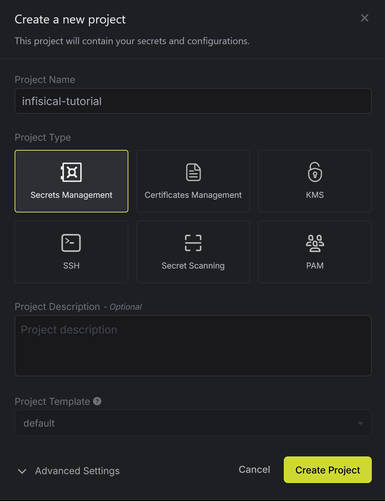
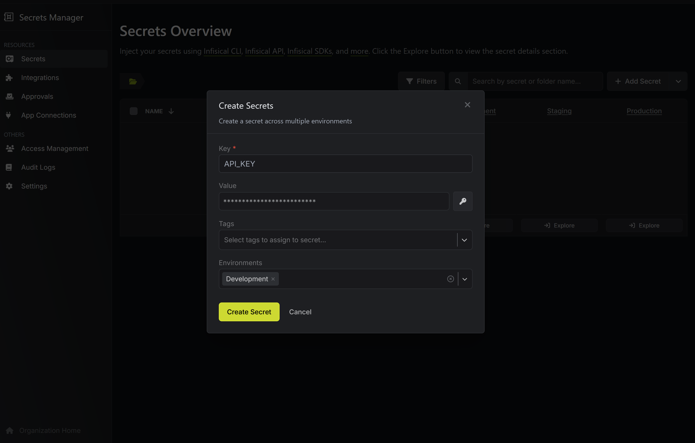
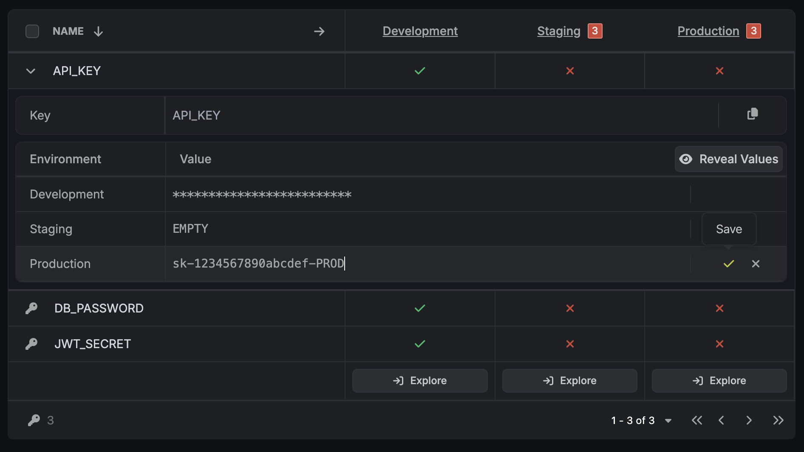
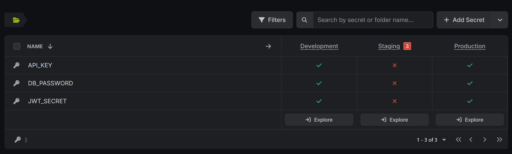

# Secure Secrets Management with Infisical

Now that we've learned how to detect secrets, let's implement a proper solution for managing them securely. In this section, we'll replace our hardcoded secrets with Infisical's secure secret management system, allowing us to store secrets safely and access them at runtime.

## Setting Up Infisical Account

### Create Your Infisical Account

First, we need to create a free account with Infisical to access their secret management services:

1. **Visit Infisical**: Go to [infisical.com](https://infisical.com)
2. **Sign Up**: Create a free account to get started
   - We signed up using the **Europe data region**
   - This will give you access to Infisical's cloud-based secret management services

### Create Your First Project

Once you've created your account:

1. **Create a New Project**: 
   - Click "Add New Project"
   - Name it `infisical-tutorial` (or any name you prefer)
   - Choose `Secrets Management`


<br />

## Adding Secrets to Infisical

Now let's add the secrets that will replace our hardcoded ones from Section 1.

### Add Development Environment Secrets

In your newly created project, click on *+ Add Secret* and add this set of secrets:

```
# Secret 1
Key = API_KEY
Value = sk-1234567890abcdef-DEV
Environments = Development

# Secret 2
Key =  DB_PASSWORD
Value = mypassword123-DEV
Environments = Development

# Secret 3
Key = JWT_SECRET
Value = super-secret-jwt-key-DEV
Environments = Development
```

Make sure that they are created in the *Development* Environment.


<br />

This allows us to store different sets of keys for different development stages.

### Add Production Environment Secrets

Now we will add another set for the *production* environment. Expand each of the keys we just created and we can easily add the values for production.


<br />

```
# Secret 1
Key = API_KEY
Value = sk-1234567890abcdef-PROD
Environments = Production

# Secret 2
Key =  DB_PASSWORD
Value = mypassword123-PROD
Environments = Production

# Secret 3
Key = JWT_SECRET
Value = super-secret-jwt-key-PROD
Environments = Production
```

Now you notice that we have different keys set for different environment.


<br />

## Updating Our Application Code

Now let's modify our `server.js` file to use environment variables instead of hardcoded secrets.

### Replace Hardcoded Secrets

Let's update our server code to use environment variables:

```
cat > server.js << 'EOF'
import express from "express";
const app = express();
const PORT = process.env.PORT || 3000;

// ✅ GOOD: Using environment variables for secrets
// 🎉 Easter egg: The word "password" comes from "pass" + "word". Literally "word to pass"!
const API_KEY = process.env.API_KEY;
const DB_PASSWORD = process.env.DB_PASSWORD;
const JWT_SECRET = process.env.JWT_SECRET;

app.get("/", (_req, res) => res.json({
  ok: true, 
  message: "Server running with secure secrets from Infisical",
  apiKey: API_KEY,
  dbPassword: DB_PASSWORD,
  jwtSecret: JWT_SECRET
}));

app.listen(PORT, () => console.log(`listening on port ${PORT}`));
EOF
```{{exec}}


## Setting Up Infisical CLI Integration

### Login to Infisical CLI

First, let's authenticate with Infisical using the CLI:

```
# Login to Infisical (opens browser for authentication)
infisical login
```{{exec}}

### Initialize Infisical in Your Project

Make sure we're in the tutorial directory so we can initialize Infisical:

```
# Initialize Infisical in the current directory
infisical init
```{{exec}}

Select the project that you created.

This command will:
- Connect your local project to your Infisical project
- Create a `.infisical.json` configuration file
- Set up the project structure for secret management

## Testing Secure Secret Management

Now let's test our secure setup by running the application with different environments.

### Run with Development Environment

Let's start the application using the development environment secrets:

```
# Run the application with dev environment secrets
infisical run --env=dev npm start
```{{exec}}

You should now see information that Infisical has injected secrets into the application process!

Let's see if our page correctly displays the keys for Development environment we have set up: see [(port 3000)]({{TRAFFIC_HOST1_3000}}).

Did it succeed? 😁 Stop the server with `Ctrl+C` in the terminal when you're done testing.

### Run with Production Environment

Now let's test with the production environment:

```
# Run the application with prod environment secrets
infisical run --env=prod npm start
```{{exec interrupt}}

Secrets from Production environment should be injected by now.

Let's access the application again [(port 3000)]({{TRAFFIC_HOST1_3000}}) and verify that you now see the production secrets.

## Committing Secure Code

Now let's commit our secure implementation:

```
# Stop the server if it's still running
# Ctrl+C if needed
```{{exec interrupt}}

```
# Add and commit the secure version
git add server.js
git commit -m "Replace hardcoded secrets with environment variables"
git push origin main
```{{exec}}

Notice that the-pre commit hook didn't trigger any alert this time. 

And you can also see that we have passed the check in GitHub Action and the code successfully merged into `main` branch!

## Verifying Security Improvements

Let's run a final scan to confirm our secrets are no longer exposed:

```
# Run Infisical scan to verify no secrets are detected
infisical scan --verbose
```{{exec}}

You should see that no new secrets are detected in the scan results, confirming that our application is now secure. The only allert is for the secret that we deliberately commited in the beginning of this tutorial.

## What We've Accomplished

We have successfully demonstrated how to:

- **Store secrets securely** in Infisical's cloud-based platform
- **Manage different environments** (dev/prod) with separate secret sets
- **Access secrets at runtime** using Infisical CLI
- **Eliminate hardcoded secrets** from our source code
- **Maintain security** while preserving functionality

---

